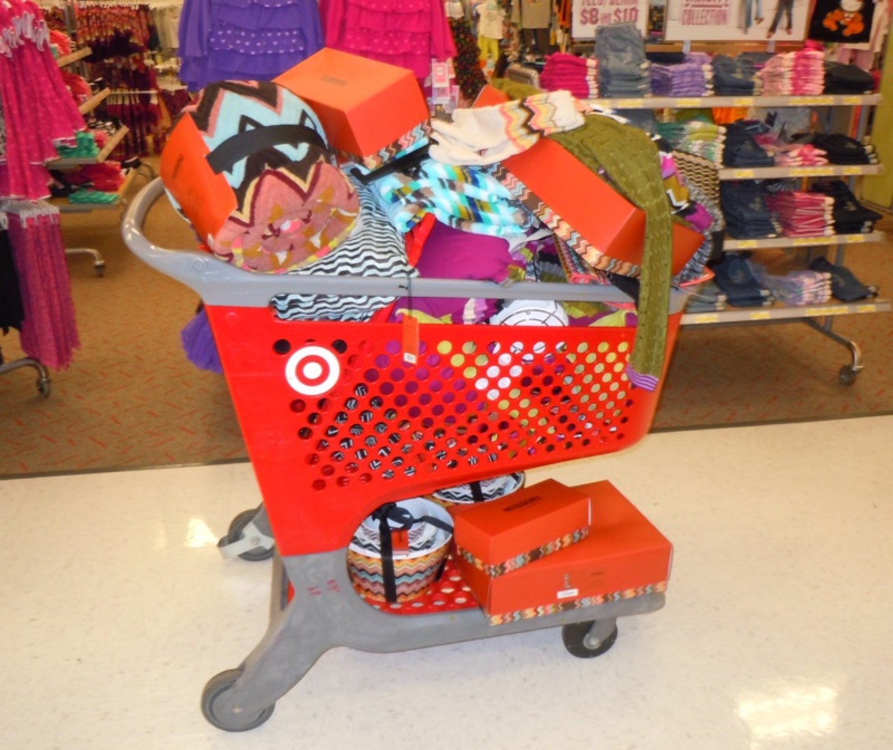
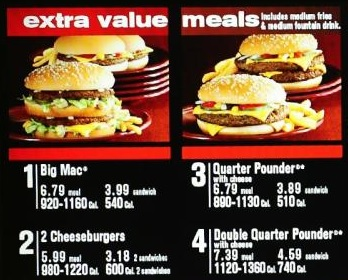
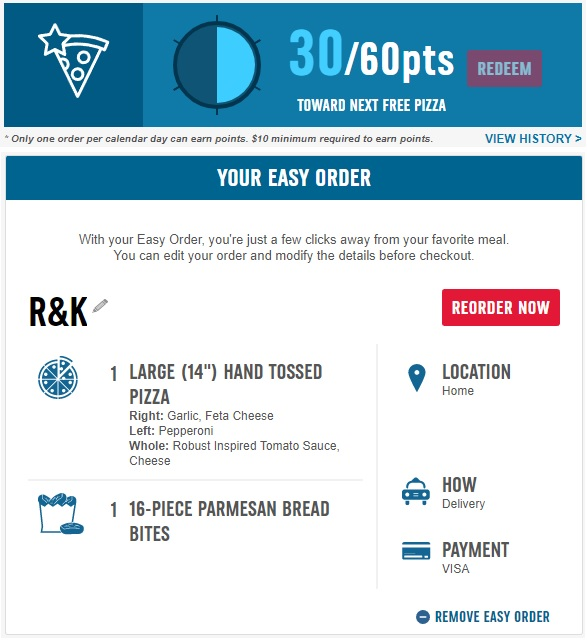

## Shopping in the Digital Age - a Psychological Battle
*by Krissy Gianforte | 14 October 2018*

Imagine your last trip to Target. You entered the store with your shopping list in-hand, intending to buy "just a few things". As you walked down the aisles, though, extra items caught your eye - a cute coffee mug, or a soft throw blanket that would definitely match your living room. And so began the battle of wits - you versus the store. Hopefully you stayed strong and focused, and ended the day with your budget at least partially in tact.

Now instead of that coffee mug and blanket, imagine that Target had an aisle designed specifically for you, containing all of the items you've *almost* purchased but decided against. As you walk through the store, you are bombarded by that pair of shoes you always wanted, sitting on a shelf right next to a box set of your favorite movies. How can you resist?

As stores collect more and more personal data on their customers, they are able to create exactly that shopping experience. But is that really a fair strategy?

### Classic economics
Stores have always used psychological tricks to help you spend more money. Shopping malls [don't have clocks](https://www.cheatsheet.com/money-career/malls-dont-clocks-tricks-use-get-spend-money.html/) to make sure you are not reminded that you need to leave; fast food restaurants offer "Extra Value Meals" that actually [aren't any less expensive than buying the items individually](https://blogs.findlaw.com/common_law/2018/04/judge-mcdonalds-extra-value-meals-dont-need-to-cost-less-than-individual-items.html), and movie theatres use [price framing](https://www.forbes.com/sites/groupthink/2014/06/18/online-decision-making-what-really-drives-customers-to-choose-one-option-over-another/#6a2d11ce2bc4) to entice you into purchasing the medium size popcorn even though it is more than you want to eat.

All of these tactics are fairly well known - and shoppers often consciously recognize that they are being manipulated. Most don't take offense though. After all, these tactics are generic, designed to trick the "average person". More careful, astute shoppers can surely avoid the traps. But that is changing in the age of big data...

### An unfair advantage
In today's digital world, stores collect an incredible amount of personal information about each and every customer: age, gender, purchase history, even how many pets you have at home. That deep knowledge allows stores to completely personalize their offerings for the individual - what an ex-CEO of Toys-R-Us called "marketing to the segment of one...the holy grail of consumer marketing"([Reuters, 2014](https://www.reuters.com/article/us-target-breach-datamining-idUSBREA0M1JM20140123)).

Suddenly, the usual psychological tricks seem a lot more sinister. For example, consider the Amazon shopping site. As you check out, Amazon offers you a quick look at a list of suggested items, 100% personalized based on your purchase history and demographics. This is similar to the "impulse buy" racks of gum and sweets by the grocery store register, but [much more powerful](https://www.mainstreethost.com/blog/psychology-of-online-buying/) because it contains *exactly the items most likely to tempt you*.

Even familiar chains like Domino's Pizza have begun using personal data to increase sales: the restaurant now offers a rewards program where customers can earn free pizza by logging-in with each purchase. Each time the customer visits the Domino's site, he is shown a progress bar towards his next free reward. This type of goal-setting is a well-recognized gamification technique designed to increase the frequency of purchases. Even futher, the Domino's site uses the customer's purchase history to create an "Easy Meal", which can be ordered with a single button-click. Ordering pizza is already tempting - even more so when it is made so effortless!

### But has it crossed a line?
These modern psychological manipulations seem unfair, though it is difficult to pinpoint a precise reason why. Perhaps the balance of power has shifted too far in favor of retailers, or perhaps over-personalization just gives consumers that "icky" feeling. To help determine whether some ethical line has truly been crossed, we can apply personal privacy analysis frameworks to this use of customers' personal data.

Daniel Solove's [Taxonomy of Privacy](https://papers.ssrn.com/sol3/papers.cfm?abstract_id=667622) provides a perfect starting point to help identify what harms may be occuring. In particular, these data-based marketing strategies may represent invasions - **Intrusion** on the customer's personal, quiet shopping time, or **Decisional Interference** as shoppers are coerced into buying products they don't want or need. However, the case is not as clear as typical examples of decisional interference. where *clearly uninvolved* parties interfere (such as the government stepping into personal reproductive decisions). Here, the seller is already an integral part of the transaction environment - so perhaps they have a right to be involved in the customer's decisions.

In order to more concretely define seller and customers' involvement and rights, we can turn to Deirdre Mulligan's [analytic for mapping privacy](http://rsta.royalsocietypublishing.org/content/374/2083/20160118). Using the analytic's terminology, we can understand the issue along multiple dimensions:
  - Dimensions of Protection: privacy protects the **subject's** (customers') **target** (decision-making space and peaceful shopping time)
  - Dimensions of Harm: the **action** (using personal data for manipulating purchases) is conducted by the **offender** (merchants)

Those definitions are straightforward; however, defining the Dimension of Theory becomes more difficult. Where we would hope to assign a clear and noble **object** that privacy provides - something as universal as dignity or personal freedom - in this case we find simply a desire to not be watched or prodded by 'big brother'. Though an understandable sentiment, it does not provide sufficient **justification** - a motivation and basis for providing privacy. Any attempt to assign a **from-whom** - an actor against whom privacy is a protection - returns somewhat empty. Privacy would protect consumers from the very merchants who collected said data.

### Business as usual
Perhaps we must recognize that personalized marketing is simply the way of the digital age. Ads and offers will become more tempting, and spending will be made excessively easy. As consumers, we must simply be aware of these tactics and train ourselves to combat them.